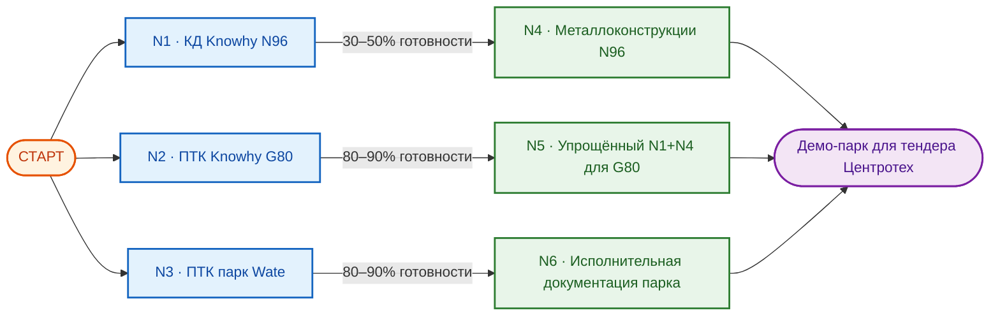
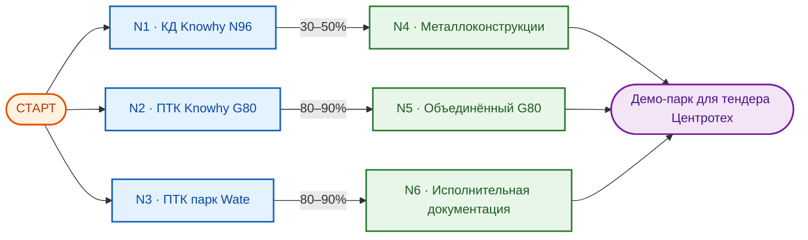
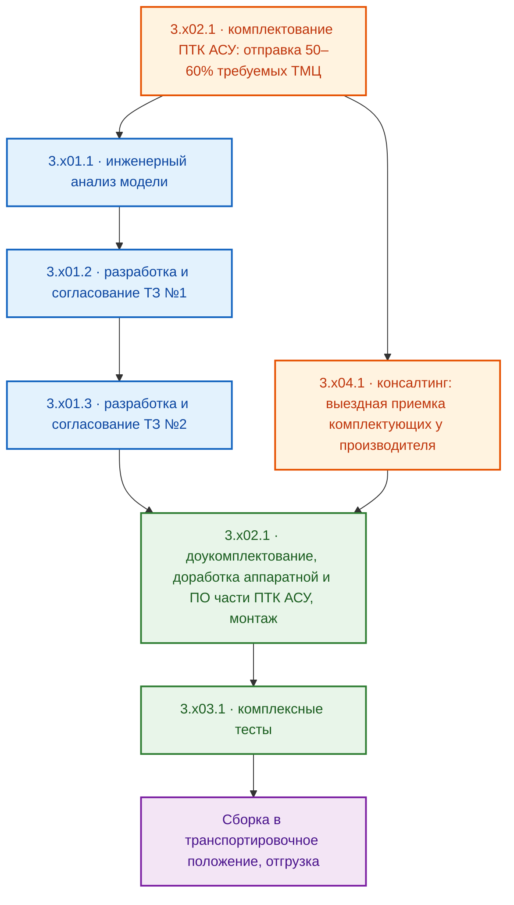

# ОТЧЕТ: ПРЕДДОГОВОРНЫЕ ПЕРЕГОВОРЫ (МИТАП 02.10.2026)

## Рамочный проект 8/2026-N0-ГОРИЗОНТ · Исполнитель ООО «ГОРИЗОНТ» · Заказчик ООО «Точные машины»

> **Назначение.** Структурированный итог преддоговорных переговоров от 02.10.2026 по трем
> прикладным заказам (N1/N2/N3), с фиксацией границ ответственности исполнителя,
> добавленных/неучтенных позиций, недостатков формулировок заказчика и перспективных
> заказов N4–N6. Данные состава и
> сроков — из спецификаций типа 40 `to_customer_fin` (срез 05.10.2026). Документ
> внутренний: коммерческие условия приводятся в объеме, согласованном с заказчиком.

---

## ОГЛАВЛЕНИЕ

1. [Общий состав заказов](#1-общий-состав-заказов)
2. [Заказ N1. Разработка КД (Knowhy N96/master)](#2-заказ-n1-разработка-кд-knowhy-n96master)
3. [Заказ N2. Адаптация ПТК Horizon VM (Knowhy G80/master)](#3-заказ-n2-адаптация-птк-horizon-vm-knowhy-g80master)
4. [Заказ N3. Адаптация ПТК Horizon VM (парк Wate technology)](#4-заказ-n3-адаптация-птк-horizon-vm-парк-wate-technology)
5. [Перспективные заказы N4–N6](#5-перспективные-заказы-n4n6)
6. [Очерёдность выполнения заказов](#6-очерёдность-выполнения-заказов)
7. [Порядок работ внутри заказов N1–N3](#7-порядок-работ-внутри-заказов-n1n3)
8. [Расхождения данных и вопросы к эскалации](#8-расхождения-данных-и-вопросы-к-эскалации)
9. [Рамочные договоры и порядок подписания](#9-рамочные-договоры-и-порядок-подписания)

---

## 1. ОБЩИЙ СОСТАВ ЗАКАЗОВ

Все заказы направлены на единственную цель заказчика — подготовку к тендеру
«ООО Центротех» (корпорация Росатом, программа цифровизации производства:
полная перестройка внутрицеховой выдачи инструмента, расходников, СИЗ).
Исполнитель — ООО «ГОРИЗОНТ» (ГК «ПЕРЕДОВЫЕ РЕШЕНИЯ»), ОСНО, НДС 22%.

| Заказ | Коммерческая функция (предмет)                                                                                                              | Результат                                 |
| :---: | :------------------------------------------------------------------------------------------------------------------------------------------ | :---------------------------------------- |
|  N1   | Разработка конструкторской документации (КД) по доработке металлоконструкции аппарата Knowhy N96/master                                     | Комплект КД                               |
|  N2   | Реверс-инжиниринг и адаптация ПТК «Horizon VM» для постаматного аппарата Knowhy G80/master                                                  | Полнофункциональный прототип              |
|  N3   | Реверс-инжиниринг группы аппаратов Wate technology и адаптация ПТК «Horizon VM» для ряда новых моделей (постаматные, спиральные, гибридные) | Полнофункциональные прототипы (7 моделей) |

Сводные финансовые требования по заказам (данные спецификаций тип 40, принцип чистой базы):

|   Заказ   | Позиций | Стоимость без НДС, руб |  НДС 22%, руб | Итого с НДС, руб |
| :-------: | :-----: | ---------------------: | ------------: | ---------------: |
|    N1     |    8    |              1 807 600 |       397 672 |        2 205 272 |
|    N2     |    5    |              2 960 000 |       651 200 |        3 611 200 |
|    N3     |   42    |             22 039 500 |     4 848 690 |       26 888 190 |
| **Итого** | **55**  |         **26 807 100** | **5 897 562** |   **32 704 662** |

> ⚠️ **Важно:** актуальный срез спецификаций тип 40 от 05.10.2026 — после перегенерации
> инженером (N1 дополнена позицией `1.102.1`, N3 — slave-моделью `3.7` и консалтингом
> `3.x04.1`). Проценты в блоках `УСЛОВИЯ ОПЛАТЫ` заявлены заказчиком ориентировочно:
> первичны абсолютные суммы, в финальных ТКП проценты не указываются.

---

## 2. ЗАКАЗ N1. РАЗРАБОТКА КД (Knowhy N96/master)

**Предмет:** цикл конструкторской проработки - доработка металлоконструкции
вендингового аппарата Knowhy N96/master — проектирования модулей размещения
электроники и коммутации, эскизы общего вида и транспортировочной тары.

### 2.1. Состав работ

| №       | НАИМЕНОВАНИЕ                                                                                         | ЕД ИЗМ. | КОЛ-ВО | ДЛИТЕЛЬНОСТЬ РЕАЛИЗАЦИИ, дней |
| :------ | :--------------------------------------------------------------------------------------------------- | :-----: | :----: | :---------------------------: |
| 1.101.1 | Проектирование модуля размещения электронных компонентов ПТК                                         |   шт    |   1    |              25               |
| 1.101.2 | Проектирование узла коммутации сети ~230 В                                                           |   шт    |   1    |              10               |
| 1.101.3 | Проектирование интегрированного узла крепления LCD touch дисплея, хаба АСУ ВУ, RFID и QR считывателя |   шт    |   1    |              20               |
| 1.101.4 | Разработка эскизов общего вида изделия                                                               |   шт    |   1    |              25               |
| 1.101.5 | Проектирование транспортировочной тары                                                               |   шт    |   1    |              15               |
| 1.102.1 | Проектирование внешнего бокса для размещения HMI компонентов (LCD, RFID, QR) и хаба ВУ              |   шт    |   1    |              45               |
| 1.101.6 | Проведение конструкторской и технологической оценки переноса (изменение) точек крепления колёс       |   шт    |   1    |              12               |
| 1.101.7 | Проектирование кронштейна камер видеонаблюдения                                                      |   шт    |   1    |              12               |

**ИТОГО БЕЗ НДС, руб: 1 807 600,00** (НДС 397 672,00; с НДС 2 205 272,00)
**ДЛИТЕЛЬНОСТЬ РЕАЛИЗАЦИИ, дней: 164** (сумма длительностей всех 8 позиций спецификации, ручной корректировки нет)

### 2.2. УСЛОВИЯ ОПЛАТЫ

- `аванс`: **70%** (1 265 320,00 руб);
- `постоплата`: процентование **30%** (542 280,00 руб) по факту выполнения работ по каждой из позиции в отдельности — исполнитель подает акт выполненных работ и запрос на частичное закрытие.

### 2.3. ДОБАВЛЕНО

- `1.101.7` — кронштейн видеокамеры: позиция добавлена исполнителем относительно
  исходной редакции заказчика на основе ранее достигнутых устных договорённостей.
- По итогам митапа **принято решение добавить разработку внешнего блока (бокса)** с
  кронштейном в состав работ — решение закреплено инженером в перегенерированной
  спецификации позицией `1.102.1` (280 000 без НДС, 45 дней).

### 2.4. НЕ УЧТЕНО

- Составом работ не предусмотрено изготовление металлоконструкций по разработанной КД — выделено в перспективный заказ `N4`, см. раздел 5.

### 2.5. НЕДОСТАТКИ

- В исходной редакции состава работ заказчиком **не была учтена разработка внешнего
  блока с кронштейном** — без неё комплект КД не покрывает изделие целиком
  (устранено решением митапа, см. п. 2.3).

### 2.6. ПРИМЕЧАНИЕ

- Результат работ — **комплект КД** (конструкторская документация), не изделия.
- Принцип исполнения: **последовательно-параллельный** — старт с первого пункта,
  при паузах (ожидание исходных данных или иное) команда переключается на другие пункты.
- По итогам митапа **принято решение добавить в состав работ разработку внешнего**.
  Позиция подлежит закреждению инженером в мастере`work spec` и отражению в перегенерированной спецификации.

---

## 3. ЗАКАЗ N2. АДАПТАЦИЯ ПТК HORIZON VM (Knowhy G80/master)

**Предмет:** реверс-инжиниринг постаматного вендингового аппарата Knowhy G80/master
и адаптация программно-технического комплекса «Horizon VM» под его конструкцию.

### 3.1. Состав работ (данные спецификации тип 40)

| №       | НАИМЕНОВАНИЕ                                                                                                    | ЕД ИЗМ. | КОЛ-ВО | ДЛИТЕЛЬНОСТЬ РЕАЛИЗАЦИИ, дней |
| :------ | :-------------------------------------------------------------------------------------------------------------- | :-----: | :----: | :---------------------------: |
| 2.101.1 | Инженерный анализ существующей конструкции изделия. Постаматный вендинговый аппарат, модель «Knowhy» G80/master |   шт    |   1    |              14               |
| 2.101.2 | Разработка ТЗ №1 на изделие в целом. Постаматный аппарат «Knowhy» G80/master                                    |   шт    |   1    |               7               |
| 2.101.3 | Разработка ТЗ №2 на адаптацию ПТК. Постаматный аппарат «Knowhy» G80/master                                      |   шт    |   1    |               7               |
| 2.102.1 | Адаптация, комплектование и сборка ПТК в соответствии с ТЗ №2. Постаматный аппарат «Knowhy» G80/master          |   шт    |   1    |              80               |
| 2.103.1 | Комплексное тестирование аппарата на базе новой системы управления. Постаматный аппарат «Knowhy» G80/master     |   шт    |   1    |              14               |

**ИТОГО БЕЗ НДС, руб: 2 960 000,00** (НДС 651 200,00; с НДС 3 611 200,00)
**ДЛИТЕЛЬНОСТЬ РЕАЛИЗАЦИИ, дней: 120** (согласовано с заказчиком; с учетом параллельной загрузки этапов меньше суммы длительностей позиций)

### 3.2. УСЛОВИЯ ОПЛАТЫ

- `аванс 1`: **55%** (1 610 000,00 руб);
- `аванс 2`: **33%** (1 000 000,00 руб) — в течение 1 месяца после поступления `аванса 1`;
- `постоплата`: **12%** (350 000,00 руб) по факту приемки работ.

### 3.3. ДОБАВЛЕНО

- Позиции, добавленные исполнителем относительно редакции заказчика, — **отсутствуют**.

### 3.4. НЕ УЧТЕНО (границы ответственности исполнителя)

- Разработка КД — не входит в заказ N2.
- Разработка эксплуатационной документации (ЭД) — не входит в заказ N2.
- Изготовление металлоконструкций — не входит в заказ N2
  (адаптируются существующие узлы аппарата G80; изготовление по упрощённой схеме
  выносится в перспективный заказ `N5`, см. раздел 5).

### 3.5. НЕДОСТАТКИ

- Явных недостатков формулировок по итогам митапа не зафиксировано; при этом
  заказчик вправе ожидать «полноценный демонстрационный образец», тогда как
  результатом заказа является **прототип** (см. п. 3.6) — граница зафиксирована
  настоящим отчётом во избежание споров о приёмке.

### 3.6. ПРИМЕЧАНИЕ

- Результат работ — **полнофункциональный прототип**. Для превращения его в
  полноценный демо-образец необходимо (вне рамок N2): доработать узлы размещения
  электроники и ввода ~230 В; возможно, полностью модернизировать выносной модуль
  HMI-элементов (есть вероятность размещения существующими средствами модуля);
  разработать и изготовить транспортировочную тару.
- Порядок выполнения внутри заказа — по цепочке одной модели VM
  (аналогично разделу 7.2/7.3).
- После выполнения работ по заказу согласована **упрощённая объединённая доработка
  (КД + металлоконструкции)** для превращения аппарата в полноценный демо-образец
  (перспективный заказ `N5`): принято решение не разрабатывать более сложные и
  дорогие решения — герметизацию боксов электроники, блокировку доступа к USB-портам,
  унификацию с постаматными моделями `Wate technology`. Решение нацелено существенно
  сократить сроки/стоимость конструкторских работ и доводки металлоконструкции
  существующего шкафа, сторонами принято как допустимое с учётом жизненного цикла
  изделия (демо-стенд, шоурум, образец для пробной эксплуатации и т.п.).

---

## 4. ЗАКАЗ N3. АДАПТАЦИЯ ПТК HORIZON VM (ПАРК WATE TECHNOLOGY)

**Предмет:** реверс-инжиниринг группы вендинговых аппаратов Wate technology
(постаматные, спиральные, гибридные модели) и разработка адаптированной версии
ПТК «Horizon VM» для ряда новых моделей. Спецификация тип 40 содержит
**7 моделей** (6 master + 1 slave, добавленная по решению митапа) по 6 позиций:
5 стандартных работ + консалтинг `3.x04.1`. Шифр заказа от заказчика — «7 VM» —
соответствует фактическому составу.

### 4.1. Состав работ (данные спецификации тип 40)

Модели заказа: `3.1` L8050 stand-alone/master (гибрид спираль/постамат);
`3.2` L8050/master (гибрид); `3.3` L80/master (спиральный);
`3.4` L50/master (спиральный); `3.5` С80/master (постаматный);
`3.6` С80P/master (постаматный); `3.7` С80/slave (постаматный, ограниченная
функциональность — выбрана исполнителем по поручению заказчика).

| №       | НАИМЕНОВАНИЕ                                                                                 | ЕД ИЗМ. | КОЛ-ВО | ДЛИТЕЛЬНОСТЬ РЕАЛИЗАЦИИ, дней |
| :------ | :------------------------------------------------------------------------------------------- | :-----: | :----: | :---------------------------: |
| 3.101.1 | Инженерный анализ существующей конструкции. Гибридный аппарат L8050 stand-alone/master       |   шт    |   1    |              14               |
| 3.101.2 | Разработка ТЗ №1 на изделие в целом. L8050 stand-alone/master                                |   шт    |   1    |               7               |
| 3.101.3 | Разработка ТЗ №2 на адаптацию ПТК к данной модели. L8050 stand-alone/master                  |   шт    |   1    |               7               |
| 3.102.1 | Адаптация, комплектование и сборка ПТК по ТЗ №2. L8050 stand-alone/master                    |   шт    |   1    |              108              |
| 3.103.1 | Комплексное тестирование аппарата на базе новой системы управления. L8050 stand-alone/master |   шт    |   1    |              14               |
| 3.104.1 | Консалтинг. Выездная приемка комплектующих на территории производителя. L8050 stand-alone/master |   шт    |   1    |               1               |
| 3.201.1 | Инженерный анализ существующей конструкции. Гибридный аппарат L8050/master                   |   шт    |   1    |              14               |
| 3.201.2 | Разработка ТЗ №1 на изделие в целом. L8050/master                                            |   шт    |   1    |               7               |
| 3.201.3 | Разработка ТЗ №2 на адаптацию ПТК к данной модели. L8050/master                              |   шт    |   1    |               7               |
| 3.202.1 | Адаптация, комплектование и сборка ПТК по ТЗ №2. L8050/master                                |   шт    |   1    |              108              |
| 3.203.1 | Комплексное тестирование аппарата на базе новой системы управления. L8050/master             |   шт    |   1    |              14               |
| 3.204.1 | Консалтинг. Выездная приемка комплектующих на территории производителя. L8050/master        |   шт    |   1    |               1               |
| 3.301.1 | Инженерный анализ существующей конструкции. Спиральный аппарат L80/master                    |   шт    |   1    |              14               |
| 3.301.2 | Разработка ТЗ №1 на изделие в целом. L80/master                                              |   шт    |   1    |               7               |
| 3.301.3 | Разработка ТЗ №2 на адаптацию ПТК. L80/master                                                |   шт    |   1    |               7               |
| 3.302.1 | Адаптация, комплектование и сборка ПТК по ТЗ №2. L80/master                                  |   шт    |   1    |              108              |
| 3.303.1 | Комплексное тестирование аппарата на базе новой системы управления. L80/master               |   шт    |   1    |              14               |
| 3.304.1 | Консалтинг. Выездная приемка комплектующих на территории производителя. L80/master           |   шт    |   1    |               1               |
| 3.401.1 | Инженерный анализ существующей конструкции. Спиральный аппарат L50/master                    |   шт    |   1    |              14               |
| 3.401.2 | Разработка ТЗ №1 на изделие в целом. L50/master                                              |   шт    |   1    |               7               |
| 3.401.3 | Разработка ТЗ №2 на адаптацию ПТК. L50/master                                                |   шт    |   1    |               7               |
| 3.402.1 | Адаптация, комплектование и сборка ПТК по ТЗ №2. Модель L50/master                           |   шт    |   1    |              108              |
| 3.403.1 | Комплексное тестирование аппарата на базе новой системы управления. L50/master               |   шт    |   1    |              14               |
| 3.404.1 | Консалтинг. Выездная приемка комплектующих на территории производителя. L50/master           |   шт    |   1    |               1               |
| 3.501.1 | Инженерный анализ существующей конструкции. Постаматный аппарат С80/master                   |   шт    |   1    |              14               |
| 3.501.2 | Разработка ТЗ №1 на изделие в целом. С80/master                                              |   шт    |   1    |               7               |
| 3.501.3 | Разработка ТЗ №2 на адаптацию ПТК к данной модели. С80/master                                |   шт    |   1    |               7               |
| 3.502.1 | Адаптация, комплектование и сборка ПТК по ТЗ №2. С80/master                                  |   шт    |   1    |              108              |
| 3.503.1 | Комплексное тестирование аппарата на базе новой системы управления. С80/master               |   шт    |   1    |              14               |
| 3.504.1 | Консалтинг. Выездная приемка комплектующих на территории производителя. С80/master           |   шт    |   1    |               1               |
| 3.601.1 | Инженерный анализ существующей конструкции. Постаматный аппарат С80P/master                  |   шт    |   1    |              14               |
| 3.601.2 | Разработка ТЗ №1 на изделие в целом. С80P/master                                             |   шт    |   1    |               7               |
| 3.601.3 | Разработка ТЗ №2 на адаптацию ПТК к данной модели. С80P/master                               |   шт    |   1    |               7               |
| 3.602.1 | Адаптация, комплектование и сборка ПТК по ТЗ №2. С80P/master                                 |   шт    |   1    |              108              |
| 3.603.1 | Комплексное тестирование аппарата на базе новой системы управления. С80P/master              |   шт    |   1    |              14               |
| 3.604.1 | Консалтинг. Выездная приемка комплектующих на территории производителя. С80P/master         |   шт    |   1    |               1               |
| 3.701.1 | Инженерный анализ существующей конструкции. Постаматный аппарат С80/slave                    |   шт    |   1    |              14               |
| 3.701.2 | Разработка ТЗ №1 на изделие в целом. С80/slave                                               |   шт    |   1    |               7               |
| 3.701.3 | Разработка ТЗ №2 на адаптацию ПТК к данной модели. С80/slave                                 |   шт    |   1    |               7               |
| 3.702.1 | Адаптация, комплектование и сборка ПТК по ТЗ №2. С80/slave                                    |   шт    |   1    |             108               |
| 3.703.1 | Комплексное тестирование аппарата на базе новой системы управления. С80/slave                |   шт    |   1    |              14               |
| 3.704.1 | Консалтинг. Выездная приемка комплектующих на территории производителя. С80/slave           |   шт    |   1    |               1               |

**ИТОГО БЕЗ НДС, руб: 22 039 500,00** (НДС 4 848 690,00; с НДС 26 888 190,00)
**ДЛИТЕЛЬНОСТЬ РЕАЛИЗАЦИИ, дней: 180** (согласовано с заказчиком; с учетом параллельной загрузки этапов и «теневых» факторов меньше суммы длительностей позиций)

### 4.2. УСЛОВИЯ ОПЛАТЫ

Заказ разбивается на две части по ~50%: `аванс 1` и `аванс 2` запускают закупки
комплектующих соответственно по первой и второй части.

- `аванс 1`: **30%** (6 000 000,00 руб);
- `аванс 2`: **30%** (6 000 000,00 руб) — в течение 1 месяца после поступления `аванса 1`;
- `аванс 3`: **28%** (7 390 000,00 руб) — покрывает продолжение работ и доукомплектование; в течение 1 месяца после поступления `аванса 2`;
- `аванс 4`: **1%** (199 500,00 руб) — консалтинг, за 2 недели до поездки;
- `постоплата`: процентование **11%** (2 450 000,00 руб) по факту выполнения работ по каждой из позиций (позиция = экземпляр вендингового аппарата, не строка спецификации) в отдельности — исполнитель подает акт выполненных работ и запрос на частичное закрытие.

> ⚠️ **Важно:** проценты заявлены заказчиком ориентировочно (для ориентации в долях
> авансов); первичны абсолютные суммы — их раскладка в точности равна ИТОГО
> спецификации (22 039 500,00 руб без НДС). В финальных коммерческих ТКП величины
> в процентах не указываются.

### 4.3. ДОБАВЛЕНО

- Блок позиций slave-модели `3.7` (`3.701.1`–`3.704.1`, Wate Technology С80/slave) —
  экземпляр аппарата с ограниченной функциональностью, добавлен по решению митапа;
- Консалтинг `3.x04.1` — в каждую модель добавлена позиция выездной приемки
  комплектующих на территории производителя (фильтр `x.X04.1`); общая сумма
  199 500,00 руб без НДС разбита равными долями по моделям — **28 500,00 руб**
  каждая (факт спецификации; на митапа озвучивалось «~28 000»);
- Иные позиции, добавленные исполнителем относительно редакции заказчика, — **отсутствуют**.

### 4.4. НЕ УЧТЕНО (границы ответственности исполнителя)

- Разработка КД — не входит в заказ N3.
- Разработка эксплуатационной документации (ЭД) — не входит в заказ N3
  (направление выносится в перспективный заказ `N6`, см. раздел 5).
- Изготовление металлоконструкций — не входит в заказ N3.

### 4.5. НЕДОСТАТКИ

- Отсутствие slave-модели в исходной редакции — **устранено**: решение митапа
  закреплено в спецификации позициями `3.701.1`–`3.704.1` (см. п. 4.6);
- **Не учтено ТМЦ на формирование стенда** для отработки — по состоянию на срез
  05.10.2026 в спецификации отсутствует; заказчик ведет проработку (см. п. 4.6) —
  вопрос открыт, отслеживается;
- Расхождение шифра «7 VM» с составом спецификации снято: после добавления
  slave-модели состав — ровно 7 моделей.

### 4.6. ПРИМЕЧАНИЕ

- Результат работ — **полнофункциональные прототипы** по каждой модели.
  Для превращения в полноценные демо-образцы необходимо (вне рамок N3):
  разработать модуль размещения электроники с учётом требований по пылевой
  обстановке; узел ввода ~230 В; модуль размещения HUB верхнего уровня и
  HMI-компонентов с учётом пылевой обстановки; разработать транспортировочную тару.
- Фактически объём доработок повторяет почти все пункты заказа N1, но большая часть
  выполняется **не с нуля, а как адаптация достигнутого ранее результата по КД**.
- По вопросу отсутствия модели `slave`: заказчиком принято решение учесть одну
  подобную модель в составе работ; модель будет определена при подписании
  спецификации, исполнителю поручено добавить любую модель постаматного типа
  самостоятельно, не дожидаясь обновления заказа — добавлена `С80/slave`.
- По получению и комплектованию ТМЦ для стенда: заказчик дал пояснения — работа
  ведется; после прояснения возможности со стороны производителя комплектующих
  (`Wate technology`) стороны вернутся к диалогу. На текущий момент необходимых
  исходных данных и условий получения комплекта нет.
- Требование заказчика учесть расходы на консалтинговые услуги (выездная приемка
  комплектующих на территории производителя) — сумма согласована до 200 тыс. руб;
  учтена в спецификации позициями `3.x04.1` в размере 199 500,00 руб без НДС.

---

## 5. ПЕРСПЕКТИВНЫЕ ЗАКАЗЫ N4–N6

Выявлены и проговорены с заказчиком на митапе как логическое продолжение программы.
Формальный порядок нумерации не соответствует порядку выполнения — реальные
триггеры старта указаны ниже.

### 5.1. Заказ N4 — Изготовление металлоконструкций по КД заказа N1

- **Суть:** подготовка разверток, выбор производственного подрядчика, согласование
  параметров с технологами подрядчика, размещение заказа, интеграция готовых
  изделий в аппарат Knowhy N96, выдача корректировок конструктору при монтажных
  недостатках и организация повторного цикла.
- **Корреляция:** прямой «выход» из N1 (получает КД) и «вход» для демо-сборки;
  закрывает подраздел `НЕ УЧТЕНО` заказа N1.
- **Место в очереди:** старт при готовности 30–50% работ по N1.

### 5.2. Заказ N5 — Объединённый упрощённый N1+N4 для Knowhy G80

- **Суть:** по упрощённой схеме выполнить работы, аналогичные заказам N1 и N4,
  в отношении адаптированного аппарата на базе шкафа Knowhy G80.
- **Корреляция:** опирается на результаты N2 (адаптированный прототип G80) и
  на «библиотеку» КД, наработанную в N1/N4, — за счёт этого схема упрощённая.
- **Место в очереди:** старт при готовности 80–90% работ по N2.

### 5.3. Заказ N6 — Исполнительная документация парка N3

- **Суть:** разработка исполнительной документации для **всех** вендинговых
  аппаратов по заказу N3 за один «заход» (единым пакетом, без дробления по моделям).
- **Корреляция:** завершает N3 документально (закрывает `НЕ УЧТЕНО` по ЭД
  для заказов N2/N3), нужен заказчику для приёмки тендерных образцов.
- **Место в очереди:** активация при готовности 70–80% работ по N3.

---

## 6. ОЧЕРЁДНОСТЬ ВЫПОЛНЕНИЯ ЗАКАЗОВ

Формальный порядок: `N1 → N2 → N3 → N4 → N5 → N6`. Реальные цепочки во времени
(на выбор Хозяина, для переговоров с заказчиком):

### 6.1. Вариант А — последовательный вход N3

Старты N1 и N2 — одновременно; N3 стартует **не дожидаясь** результатов N1/N2.

### 6.2. Вариант Б — параллельный вход всех заказов (предпочтительнее)

Отличие от варианта А: N1, N2, N3 стартуют **одновременно** — максимальная
скорость выхода на демо-парк, максимальная нагрузка на инженерный ресурс в начале.

---

## 7. ПОРЯДОК РАБОТ ВНУТРИ ЗАКАЗОВ N1–N3

### 7.1. Заказ N1

Все пункты выполняются в порядке следования в спецификации; принцип
**последовательно-параллельный**: старт с первого пункта, при возникновении паузы
(например, ожидание конструктором очередной порции исходных данных) команда
проекта переключается на другой пункт списка.

### 7.2. Заказ N2

Порядок работ — как цепочка одной модели VM из состава N3 (раздел 7.3):
аналогично пунктам одной группы VM, не непосредственно нумерации спецификации.

### 7.3. Заказ N3 (единый шаблон для каждой модели VM)

Набор работ одинаков для всех моделей; различается только режим сопряжения
аналогичных пунктов между моделями:

| Этап                                             | Режим относительно других моделей                                |
| :----------------------------------------------- | :--------------------------------------------------------------- |
| `3.x02.1` комплектование ПТК АСУ (первый проход) | одновременно/параллельно по всем видам аппаратов, включая Knowhy |
| `3.x01.1` инженерный анализ                      | последовательно                                                  |
| `3.x01.2` ТЗ №1                                  | последовательно/параллельно                                      |
| `3.x01.3` ТЗ №2                                  | последовательно/параллельно                                      |
| `3.x04.1` консалтинг (выездная приемка ТМЦ)      | по мере готовности партии ТМЦ, 1 день на модель, всего 199 500 руб без НДС |
| `3.x02.1` доукомплектование и монтаж             | последовательно/параллельно                                      |
| `3.x03.1` комплексные тесты                      | последовательно                                                  |
| Отгрузка                                         | очередность по договорённости с заказчиком                       |

---

## 8. РАСХОЖДЕНИЯ ДАННЫХ И ВОПРОСЫ К ЭСКАЛАЦИИ

Актуализация по состоянию на срез спецификаций 05.10.2026 (перегенерация после митапа):

1. ✅ **Строка «Итог» спецификации тип 40 N3** — закрыто: после перегенерации
   значение 22 039 500 руб без НДС (НДС 4 848 690) точно равно сумме 42 позиций.
2. ✅ **Шифр N3 «7 VM» против 6 моделей** — закрыто: седьмая модель — `3.7`
   (С80/slave), добавлена по решению митапа (п. 4.3/4.6); окончательное
   утверждение модели — при подписании спецификации.
3. ✅ **Позиция «внешний бокс» по N1** — закрыто: закреплена в спецификации
   как `1.102.1` (280 000 без НДС, 45 дней).
4. ✅ **Артефакты форматирования блока «ПРИМЕЧАНИЯ»** (`t…t`, `1.101.7t`) —
   после перегенерации блок из выходных документов исключен; замечаний нет.
5. ❓ **Консалтинг по N3: «≈28 000» (митап) против 28 500,00 (факт спецификации)** —
   принято решение отчета: базовым считать факт `3.x04.1` = 28 500 × 7 моделей =
   199 500,00 (итог и `аванс 4` сходятся). Эскалация не требуется.
6. ❓ **Проценты авансов N3** — расхождение заявленных долей с фактическими
   (30%↔27,2%, 28%↔33,5% от итога 22 039 500) свыше 1%; по решению Хозяина
   в отчете сохранены заявленные проценты с пометкой «ориентировочно», первичны
   абсолютные суммы. В ТКП — только абсолютные цифры.
7. ⚠️ **Опечатка в наименовании позиций консалтинга спецификации N3** —
   «…на территории производител» (пропущен «я»); все 7 позиций `3.x04.1`.
   Эскалация инженеру: правка в мастере `NAME PRODUCT`, перегенерация 30/40
   до направления заказчику.
8. ⚠️ **Порядок позиции `1.102.1`** — в спецификации N1 она следует между
   `1.101.5` и `1.101.6` (комплект `1.102` внутри нумерации комплекта `1.101`);
   в отчете сохранен фактический порядок спецификации. Проверить `NUM SEQUENCE SET`
   мастера при следующей ревизии — на коммерческие условия не влияет.

---

## 9. РАМОЧНЫЕ ДОГОВОРЫ И ПОРЯДОК ПОДПИСАНИЯ

Исполнитель и заказчик работают в паре юрлиц ГК «ПЕРЕДОВЫЕ РЕШЕНИЯ» с 2025 года:

| Параметр | Значение |
| :--- | :--- |
| Ранее подписанный рамочный договор | `27/2025-N0-МАС` — исполнитель **ООО «Мобильные Автоматизированные Системы»** (ООО МАС, ГК «ПЕРЕДОВЫЕ РЕШЕНИЯ»); прикладной заказ `27/2025-N1-МАС` |
| Активный рамочный договор | `8/2026-N0-ГОРИЗОНТ` — исполнитель **ООО «ГОРИЗОНТ»**; все заказы настоящего проекта относятся к нему (нумерация исполнителя) |
| На подписание заказчику | рамочный договор `8/2026-N0-ГОРИЗОНТ` (`04__Договор/01__В стадии согласования/`) |

Заказы, по которым требуется подписание **только коммерческих спецификаций/ТКП**
(в рамках активного рамочного договора):

1. **Заказ 1** — `8/2026-N1-ГОРИЗОНТ`;
2. **Заказ 2** — `8/2026-N2-ГОРИЗОНТ`;
3. **Заказ 3** — `8/2026-N3-ГОРИЗОНТ`.

> ⚠️ **Важно:** содержание рамочного договора `8/2026-N0-ГОРИЗОНТ` совпадает
> с ранее подписанным `27/2025-N0-МАС` с точностью до точки (замена исполнителя
> в рамках ГК). Этот юридический момент необходимо довести до юристов компании
> заказчика — договор не требует повторной правовой экспертизы, что существенно
> ускоряет согласование.

---

**Версия документации:** 1.1 · **Дата актуализации:** 05 октября 2026 г.
**Источники:** мастер `20__work_spec #8_2026-n0-горизонт` (срез 30.09.2026),
спецификации тип 40 заказов N1–N3 (срез 05.10.2026, после перегенерации),
протокол митапа 02.10.2026, условия оплаты от заказчика (05.10.2026).
