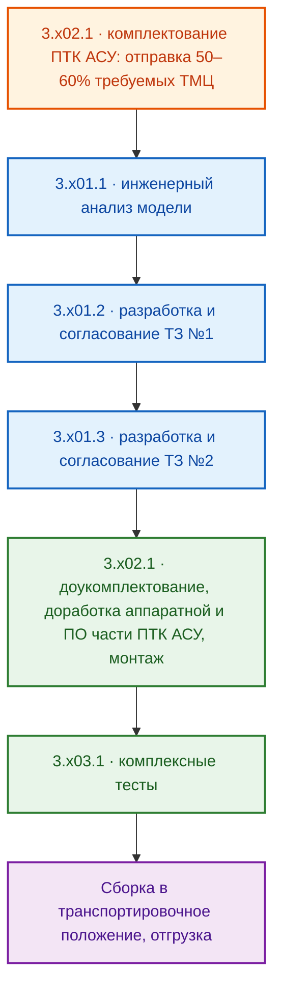

# ОТЧЕТ: ПРЕДДОГОВОРНЫЕ ПЕРЕГОВОРЫ (МИТАП 02.10.2026)
## Рамочный проект 8/2026-N0-ГОРИЗОНТ · Исполнитель ООО «ГОРИЗОНТ» · Заказчик ООО «Точные машины»

> **Назначение.** Структурированный итог преддоговорных переговоров от 02.10.2026 по трем
> прикладным заказам (N1/N2/N3), поступившим от заказчика в адрес ООО «Горизонт», с
> фиксацией границ ответственности исполнителя, добавленных/неучтенных позиций,
> недостатков формулировок заказчика и перспективных заказов N4–N6. Данные состава и
> сроков — из спецификаций типа 40 `to_customer_fin` (срез 05.10.2026). Документ
> внутренний: коммерческие условия приводятся в объеме, согласованном с заказчиком.

---

## ОГЛАВЛЕНИЕ

1. [Общий состав заказов](#1-общий-состав-заказов)
2. [Заказ N1 — Разработка КД (Knowhy N96/master)](#2-заказ-n1--разработка-кд-knowhy-n96master)
3. [Заказ N2 — Адаптация ПТК Horizon VM (Knowhy G80/master)](#3-заказ-n2--адаптация-птк-horizon-vm-knowhy-g80master)
4. [Заказ N3 — Адаптация ПТК Horizon VM (парк Wate technology)](#4-заказ-n3--адаптация-птк-horizon-vm-парк-wate-technology)
5. [Перспективные заказы N4–N6](#5-перспективные-заказы-n4n6)
6. [Очерёдность выполнения заказов](#6-очерёдность-выполнения-заказов)
7. [Порядок работ внутри заказов N1–N3](#7-порядок-работ-внутри-заказов-n1n3)
8. [Расхождения данных и вопросы к эскалации](#8-расхождения-данных-и-вопросы-к-эскалации)

---

## 1. ОБЩИЙ СОСТАВ ЗАКАЗОВ

Все заказы направлены на единственную цель заказчика — подготовку к тендеру
«ООО Центротех» (корпорация Росатом, программа цифровизации производства:
полная перестройка внутрицеховой выдачи инструмента, расходников, СИЗ).
Исполнитель — ООО «ГОРИЗОНТ» (ГК «ПЕРЕДОВЫЕ РЕШЕНИЯ»), ОСНО, НДС 22%.

| Заказ | Коммерческая функция (предмет) | Результат |
| :---: | :--- | :--- |
| N1 | Разработка конструкторской документации (КД) по доработке металлоконструкции аппарата Knowhy N96/master | Комплект КД |
| N2 | Реверс-инжиниринг и адаптация ПТК «Horizon VM» для постаматного аппарата Knowhy G80/master | Полнофункциональный прототип |
| N3 | Реверс-инжиниринг группы аппаратов Wate technology и адаптация ПТК «Horizon VM» для ряда новых моделей (постаматные, спиральные, гибридные) | Полнофункциональные прототипы (6 моделей) |

Сводные финансовые требования по заказам (данные спецификаций тип 40, принцип чистой базы):

| Заказ | Позиций | Стоимость без НДС, руб | НДС 22%, руб | Итого с НДС, руб |
| :---: | :---: | ---: | ---: | ---: |
| N1 | 7 | 1 527 600 | 336 072 | 1 863 672 |
| N2 | 5 | 2 960 000 | 651 200 | 3 611 200 |
| N3 | 30 | 18 720 000 | 4 118 400 | 22 838 400 |
| **Итого** | **42** | **23 207 600** | **5 105 672** | **28 313 272** |

> ⚠️ **Важно:** сумма по N3 рассчитана суммированием 30 позиций спецификации;
> строка «Итог» в файле типа 40 заказа N3 содержит значение одной модели
> (3 120 000) — см. раздел 8, эскалация инженеру.

---

## 2. ЗАКАЗ N1 — РАЗРАБОТКА КД (Knowhy N96/master)

**Предмет:** полный цикл конструкторской проработки доработки металлоконструкции
вендингового аппарата Knowhy N96/master — от проектирования модулей размещения
электроники и коммутации до эскизов общего вида и транспортировочной тары.

### 2.1. Состав работ (данные спецификации тип 40)

| № | НАИМЕНОВАНИЕ | ЕД ИЗМ. | КОЛ-ВО | ДЛИТЕЛЬНОСТЬ РЕАЛИЗАЦИИ, дней |
| :--- | :--- | :---: | :---: | :---: |
| 1.101.1 | Проектирование модуля размещения электронных компонентов ПТК | шт | 1 | 25 |
| 1.101.2 | Проектирование узла коммутации сети ~230 В | шт | 1 | 10 |
| 1.101.3 | Проектирование интегрированного узла крепления LCD touch дисплея, хаба АСУ ВУ, RFID и QR считывателя | шт | 1 | 20 |
| 1.101.4 | Разработка эскизов общего вида изделия | шт | 1 | 25 |
| 1.101.5 | Проектирование транспортировочной тары | шт | 1 | 15 |
| 1.101.6 | Проведение конструкторской и технологической оценки переноса (изменение) точек крепления колёс | шт | 1 | 12 |
| 1.101.7 | Проектирование кронштейна камер видеонаблюдения | шт | 1 | 12 |

### 2.2. ДОБАВЛЕНО

* `1.101.7` — кронштейн видеокамеры: позиция добавлена исполнителем относительно
  исходной редакции заказчика на основе ранее достигнутых устных договорённостей.
* По итогам митапа **принято решение добавить разработку внешнего блока (бокса)** с
  кронштейном в состав работ — позиция подлежит закреждению инженером в мастере
  `work spec` и отражению в перегенерированной спецификации.

### 2.3. НЕ УЧТЕНО

* Изготовление металлоконструкций по разработанной КД — **не входит** в заказ N1
  (выделено в перспективный заказ `N4`, см. раздел 5).

### 2.4. НЕДОСТАТКИ

* В исходной редакции состава работ заказчиком **не была учтена разработка внешнего
  блока с кронштейном** — без неё комплект КД не покрывает изделие целиком
  (устранено решением митапа, см. п. 2.2).

### 2.5. ВЫВОДЫ

* Результат работ — **комплект КД** (конструкторская документация), не изделия.
* Принцип исполнения: **последовательно-параллельный** — старт с первого пункта,
  при паузах (ожидание исходных данных) команда переключается на другие пункты.
* Предельная длительность выполнения работ: **119 календарных дней**
  (суммарная последовательная загрузка всех 7 позиций).

---

## 3. ЗАКАЗ N2 — АДАПТАЦИЯ ПТК HORIZON VM (Knowhy G80/master)

**Предмет:** реверс-инжиниринг постаматного вендингового аппарата Knowhy G80/master
и адаптация программно-технического комплекса «Horizon VM» под его конструкцию.

### 3.1. Состав работ (данные спецификации тип 40)

| № | НАИМЕНОВАНИЕ | ЕД ИЗМ. | КОЛ-ВО | ДЛИТЕЛЬНОСТЬ РЕАЛИЗАЦИИ, дней |
| :--- | :--- | :---: | :---: | :---: |
| 2.101.1 | Инженерный анализ существующей конструкции изделия. Постаматный вендинговый аппарат, модель «Knowhy» G80/master | шт | 1 | 14 |
| 2.101.2 | Разработка ТЗ №1 на изделие в целом. Постаматный аппарат «Knowhy» G80/master | шт | 1 | 7 |
| 2.101.3 | Разработка ТЗ №2 на адаптацию ПТК. Постаматный аппарат «Knowhy» G80/master | шт | 1 | 7 |
| 2.102.1 | Адаптация, комплектование и сборка ПТК в соответствии с ТЗ №2. Постаматный аппарат «Knowhy» G80/master | шт | 1 | 80 |
| 2.103.1 | Комплексное тестирование аппарата на базе новой системы управления. Постаматный аппарат «Knowhy» G80/master | шт | 1 | 14 |

### 3.2. ДОБАВЛЕНО

* Позиции, добавленные исполнителем относительно редакции заказчика, — **отсутствуют**.

### 3.3. НЕ УЧТЕНО (границы ответственности исполнителя)

* Разработка КД — не входит в заказ N2.
* Разработка эксплуатационной документации (ЭД) — не входит в заказ N2.
* Изготовление металлоконструкций — не входит в заказ N2
  (адаптируются существующие узлы аппарата G80; изготовление по упрощённой схеме
  выносится в перспективный заказ `N5`, см. раздел 5).

### 3.4. НЕДОСТАТКИ

* Явных недостатков формулировок по итогам митапа не зафиксировано; при этом
  заказчик вправе ожидать «полноценный демонстрационный образец», тогда как
  результатом заказа является **прототип** (см. п. 3.5) — граница зафиксирована
  настоящим отчётом во избежание споров о приёмке.

### 3.5. ВЫВОДЫ

* Результат работ — **полнофункциональный прототип**. Для превращения его в
  полноценный демо-образец необходимо (вне рамок N2): доработать узлы размещения
  электроники и ввода ~230 В; возможно, полностью модернизировать выносной модуль
  HMI-элементов (есть вероятность размещения существующими средствами модуля);
  разработать и изготовить транспортировочную тару.
* Порядок выполнения внутри заказа — по цепочке одной модели VM
  (аналогично разделу 7.2/7.3).
* Предельная длительность выполнения работ: **122 календарных дня**
  (последовательная цепочка 14+7+7+80+14).

---

## 4. ЗАКАЗ N3 — АДАПТАЦИЯ ПТК HORIZON VM (ПАРК WATE TECHNOLOGY)

**Предмет:** реверс-инжиниринг группы вендинговых аппаратов Wate technology
(постаматные, спиральные, гибридные модели) и разработка адаптированной версии
ПТК «Horizon VM» для ряда новых моделей. Спецификация тип 40 содержит
**6 моделей** по 5 стандартных работ (шифр заказа от заказчика — «7 VM»,
см. раздел 8).

### 4.1. Состав работ (данные спецификации тип 40)

Модели заказа: `3.1` L8050 stand-alone/master (гибрид спираль/постамат);
`3.2` L8050/master (гибрид); `3.3` L80/master (спиральный);
`3.4` L50/master (спиральный); `3.5` С80/master (постаматный);
`3.6` С80P/master (постаматный).

| № | НАИМЕНОВАНИЕ | ЕД ИЗМ. | КОЛ-ВО | ДЛИТЕЛЬНОСТЬ РЕАЛИЗАЦИИ, дней |
| :--- | :--- | :---: | :---: | :---: |
| 3.101.1 | Инженерный анализ существующей конструкции. Гибридный аппарат L8050 stand-alone/master | шт | 1 | 14 |
| 3.101.2 | Разработка ТЗ №1 на изделие в целом. L8050 stand-alone/master | шт | 1 | 7 |
| 3.101.3 | Разработка ТЗ №2 на адаптацию ПТК к данной модели. L8050 stand-alone/master | шт | 1 | 7 |
| 3.102.1 | Адаптация, комплектование и сборка ПТК по ТЗ №2. L8050 stand-alone/master | шт | 1 | 108 |
| 3.103.1 | Комплексное тестирование аппарата на базе новой системы управления. L8050 stand-alone/master | шт | 1 | 14 |
| 3.201.1 | Инженерный анализ существующей конструкции. Гибридный аппарат L8050/master | шт | 1 | 14 |
| 3.201.2 | Разработка ТЗ №1 на изделие в целом. L8050/master | шт | 1 | 7 |
| 3.201.3 | Разработка ТЗ №2 на адаптацию ПТК к данной модели. L8050/master | шт | 1 | 7 |
| 3.202.1 | Адаптация, комплектование и сборка ПТК по ТЗ №2. L8050/master | шт | 1 | 108 |
| 3.203.1 | Комплексное тестирование аппарата на базе новой системы управления. L8050/master | шт | 1 | 14 |
| 3.301.1 | Инженерный анализ существующей конструкции. Спиральный аппарат L80/master | шт | 1 | 14 |
| 3.301.2 | Разработка ТЗ №1 на изделие в целом. L80/master | шт | 1 | 7 |
| 3.301.3 | Разработка ТЗ №2 на адаптацию ПТК. L80/master | шт | 1 | 7 |
| 3.302.1 | Адаптация, комплектование и сборка ПТК по ТЗ №2. L80/master | шт | 1 | 108 |
| 3.303.1 | Комплексное тестирование аппарата на базе новой системы управления. L80/master | шт | 1 | 14 |
| 3.401.1 | Инженерный анализ существующей конструкции. Спиральный аппарат L50/master | шт | 1 | 14 |
| 3.401.2 | Разработка ТЗ №1 на изделие в целом. L50/master | шт | 1 | 7 |
| 3.401.3 | Разработка ТЗ №2 на адаптацию ПТК. L50/master | шт | 1 | 7 |
| 3.402.1 | Адаптация, комплектование и сборка ПТК по ТЗ №2. Модель L50/master | шт | 1 | 108 |
| 3.403.1 | Комплексное тестирование аппарата на базе новой системы управления. L50/master | шт | 1 | 14 |
| 3.501.1 | Инженерный анализ существующей конструкции. Постаматный аппарат С80/master | шт | 1 | 14 |
| 3.501.2 | Разработка ТЗ №1 на изделие в целом. С80/master | шт | 1 | 7 |
| 3.501.3 | Разработка ТЗ №2 на адаптацию ПТК к данной модели. С80/master | шт | 1 | 7 |
| 3.502.1 | Адаптация, комплектование и сборка ПТК по ТЗ №2. С80/master | шт | 1 | 108 |
| 3.503.1 | Комплексное тестирование аппарата на базе новой системы управления. С80/master | шт | 1 | 14 |
| 3.601.1 | Инженерный анализ существующей конструкции. Постаматный аппарат С80P/master | шт | 1 | 14 |
| 3.601.2 | Разработка ТЗ №1 на изделие в целом. С80P/master | шт | 1 | 7 |
| 3.601.3 | Разработка ТЗ №2 на адаптацию ПТК к данной модели. С80P/master | шт | 1 | 7 |
| 3.602.1 | Адаптация, комплектование и сборка ПТК по ТЗ №2. С80P/master | шт | 1 | 108 |
| 3.603.1 | Комплексное тестирование аппарата на базе новой системы управления. С80P/master | шт | 1 | 14 |

### 4.2. ДОБАВЛЕНО

* Позиции, добавленные исполнителем относительно редакции заказчика, — **отсутствуют**.

### 4.3. НЕ УЧТЕНО (границы ответственности исполнителя)

* Разработка КД — не входит в заказ N3.
* Разработка эксплуатационной документации (ЭД) — не входит в заказ N3
  (направление выносится в перспективный заказ `N6`, см. раздел 5).
* Изготовление металлоконструкций — не входит в заказ N3.

### 4.4. НЕДОСТАТКИ

* В составе заказа **отсутствует slave-модель аппарата** — без неё невозможно
  отработать целевую топологию «мастер–слейв» выдачного парка Росатом.
* **Не учтено ТМЦ на формирование стенда** для отработки — без стенда сроки
  и качество комплексной обкатки ПТК под угрозой.
* Шифр заказа — «7 VM», фактический состав спецификации — 6 моделей; требуется
  сверка с заказчиком (предположение: седьмая VM — пропущенная slave-модель).

### 4.5. ВЫВОДЫ

* Результат работ — **полнофункциональные прототипы** по каждой модели.
  Для превращения в полноценные демо-образцы необходимо (вне рамок N3):
  разработать модуль размещения электроники с учётом требований по пылевой
  обстановке; узел ввода ~230 В; модуль размещения HUB верхнего уровня и
  HMI-компонентов с учётом пылевой обстановки; разработать транспортировочную тару.
* Фактически объём доработок повторяет почти все пункты заказа N1, но большая часть
  выполняется **не с нуля, а как адаптация достигнутого ранее результата по КД**.
* Предельная длительность выполнения работ: **≈ 290 календарных дней** —
  цепочка первой модели (14+7+7+108+14 = 150) плюс последовательные этапы
  инженерных анализов и комплексных тестированиями остальных 5 моделей
  (5×14 + 5×14 = 140) при параллельном/последовательном прохождении ТЗ и адаптаций.
  При полностью последовательном проходе ТЗ этапов (+2×7×5) — до 360 кал. дней;
  точный план-график формируется после подписания прикладного договора.

---

## 5. ПЕРСПЕКТИВНЫЕ ЗАКАЗЫ N4–N6

Выявлены и проговорены с заказчиком на митапе как логическое продолжение программы.
Формальный порядок нумерации не соответствует порядку выполнения — реальные
триггеры старта указаны ниже.

### 5.1. Заказ N4 — Изготовление металлоконструкций по КД заказа N1

* **Суть:** подготовка разверток, выбор производственного подрядчика, согласование
  параметров с технологами подрядчика, размещение заказа, интеграция готовых
  изделий в аппарат Knowhy N96, выдача корректировок конструктору при монтажных
  недостатках и организация повторного цикла.
* **Корреляция:** прямой «выход» из N1 (получает КД) и «вход» для демо-сборки;
  закрывает подраздел `НЕ УЧТЕНО` заказа N1.
* **Место в очереди:** старт при готовности 30–50% работ по N1.

### 5.2. Заказ N5 — Объединённый упрощённый N1+N4 для Knowhy G80

* **Суть:** по упрощённой схеме выполнить работы, аналогичные заказам N1 и N4,
  в отношении адаптированного аппарата на базе шкафа Knowhy G80.
* **Корреляция:** опирается на результаты N2 (адаптированный прототип G80) и
  на «библиотеку» КД, наработанную в N1/N4, — за счёт этого схема упрощённая.
* **Место в очереди:** старт при готовности 80–90% работ по N2.

### 5.3. Заказ N6 — Исполнительная документация парка N3

* **Суть:** разработка исполнительной документации для **всех** вендинговых
  аппаратов по заказу N3 за один «заход» (единым пакетом, без дробления по моделям).
* **Корреляция:** завершает N3 документально (закрывает `НЕ УЧТЕНО` по ЭД
  для заказов N2/N3), нужен заказчику для приёмки тендерных образцов.
* **Место в очереди:** активация при готовности 70–80% работ по N3.

---

## 6. ОЧЕРЁДНОСТЬ ВЫПОЛНЕНИЯ ЗАКАЗОВ

Формальный порядок: `N1 → N2 → N3 → N4 → N5 → N6`. Реальные цепочки во времени
(на выбор Хозяина, для переговоров с заказчиком):

### 6.1. Вариант А — последовательный вход N3

Старты N1 и N2 — одновременно; N3 стартует **не дожидаясь** результатов N1/N2.

### 6.2. Вариант Б — параллельный вход всех заказов (предпочтительнее)

Отличие от варианта А: N1, N2, N3 стартуют **одновременно** — максимальная
скорость выхода на демо-парк, максимальная нагрузка на инженерный ресурс в начале.

---

## 7. ПОРЯДОК РАБОТ ВНУТРИ ЗАКАЗОВ N1–N3

### 7.1. Заказ N1

Все пункты выполняются в порядке следования в спецификации; принцип
**последовательно-параллельный**: старт с первого пункта, при возникновении паузы
(например, ожидание конструктором очередной порции исходных данных) команда
проекта переключается на другой пункт списка.

### 7.2. Заказ N2

Порядок работ — как цепочка одной модели VM из состава N3 (раздел 7.3):
аналогично пунктам одной группы VM, не непосредственно нумерации спецификации.

### 7.3. Заказ N3 (единый шаблон для каждой модели VM)

Набор работ одинаков для всех моделей; различается только режим сопряжения
аналогичных пунктов между моделями:

| Этап | Режим относительно других моделей |
| :--- | :--- |
| `3.x02.1` комплектование ПТК АСУ (первый проход) | одновременно/параллельно по всем видам аппаратов, включая Knowhy |
| `3.x01.1` инженерный анализ | последовательно |
| `3.x01.2` ТЗ №1 | последовательно/параллельно |
| `3.x01.3` ТЗ №2 | последовательно/параллельно |
| `3.x02.1` доукомплектование и монтаж | последовательно/параллельно |
| `3.x03.1` комплексные тесты | последовательно |
| Отгрузка | очередность по договорённости с заказчиком |

---

## 8. РАСХОЖДЕНИЯ ДАННЫХ И ВОПРОСЫ К ЭСКАЛАЦИИ

Фиксация по регламенту (п. 9.3 переходного документа: ключ `HASH COLLECTION`
позиции / колонка / значение в мастере / значение в производной):

1. **Строка «Итог» спецификации тип 40 заказа N3** — значение 3 120 000 руб без НДС
   (одна модель) вместо суммы 30 позиций 18 720 000 руб без НДС
   (НДС 4 118 400). Перед подписанием приложения — проверить `isPROCESSING`
   и версии позиций мастера, затем эскалировать инженеру на перегенерацию.
2. **Шифр заказа N3 «7 VM» против 6 моделей в спецификации** — предположительная
   причина: отсутствующая slave-модель (п. 4.4). Запрос заказчику на уточнение состава.
3. **Артефакты форматирования в блоке «ПРИМЕЧАНИЯ»** спецификаций: N3 — обрывки
   текста выводов (`t…t`, `ttt…`), N1 — значение `1.101.7t`. Источник — перенос
   многострочного текста из мастера; эскалация инженеру при ближайшей перегенерации.
4. **Позиция «внешний блок (бокс) с кронштейном» (решение митапа по N1)** —
   ожидается новая позиция в мастере `work spec` и отражение в спецификациях 30/40 после
   перегенерации; агент контролирует появление позиции по `NUM FULL SET` 1.101.x.

---
**Версия документации:** 1.0 · **Дата актуализации:** 05 октября 2026 г.
**Источники:** мастер `20__work_spec #8_2026-n0-горизонт` (срез 30.09.2026),
спецификации тип 40 заказов N1–N3 (срез 05.10.2026), протокол митапа 02.10.2026.
