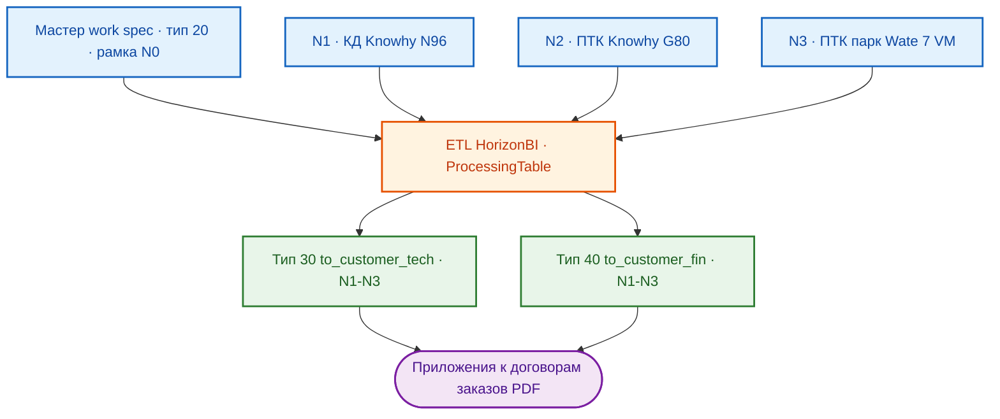

# ПРОЕКТ 8/2026-N0-ГОРИЗОНТ: ВЕНДИНГОВЫЕ АППАРАТЫ — ПИЛОТНАЯ ПАРТИЯ
**Рамочный договор · ООО «ГОРИЗОНТ» (ГК «ПЕРЕДОВЫЕ РЕШЕНИЯ») → ООО «Точные машины»**

> ⚠️ **Важно:** документ — **строго для внутреннего пользования**. Передача
> сотрудникам вне проектной команды и любые внешние копии запрещены: содержит
> внутренние бизнес-процессы, коммерческие механики и статусы переговоров.

---

## ОГЛАВЛЕНИЕ

1. [Введение](#1-введение)
2. [Обзор проекта](#2-обзор-проекта)
3. [Структура ИРП](#3-структура-ирп)
4. [Система спецификаций](#4-система-спецификаций)
5. [Бизнес-механика сделок](#5-бизнес-механика-сделок)
6. [Структура документации проекта](#6-структура-документации-проекта)
7. [Дорожная карта и статус](#7-дорожная-карта-и-статус)
8. [Технологический стек · контакты и реквизиты](#8-технологический-стек--контакты-и-реквизиты)

---

## 1. ВВЕДЕНИЕ

Рамочный договор `8/2026-N0-ГОРИЗОНТ` — базовая сделка для адаптации, разработки,
производства и поставки промышленных вендинговых аппаратов, которые ООО «ГОРИЗОНТ»
изготавливает на базе металлоконструкций китайских производителей **Knowhy** и
**Wate technology** с собственной ПТК **«Horizon VM»**. Конечная цель заказчика —
цифровизация внутрицеховой выдачи инструмента, расходников и СИЗ на площадках
конечного заказчика (атрибутика — закрытая, см. `AGENTS.md` § 1.1 п. 3).

Преемственность: с 2025 года та же связка заказчика и юрлица ГК работала по договору
`27/2025-N0-МАС` (исполнитель — ООО «МАС»). Рамочный договор `8/2026-N0` повторяет
его текст дословно — юридическая экспертиза со стороны заказчика не требуется,
согласование ускоряется (переговорный акцент).

## 2. ОБЗОР ПРОЕКТА



Состав заказов (рамка → прикладные):

| Заказ | Предмет | Позиций | Без НДС, руб | Срок, к.д. | Статус |
| :---: | :--- | :---: | ---: | :---: | :---: |
| N1 | КД доработки металлоконструкции Knowhy N96/master | 8 | 1 807 600 | 164 | готов к контрактованию |
| N2 | Адаптация ПТК Horizon VM, Knowhy G80/master | 5 | 2 960 000 | 120 | границы зафиксированы |
| N3 | Адаптация ПТК, парк Wate technology (7 VM) | 42 | 22 039 500 | 180 | недостаточно ТМЦ стенда |
| N4–N6 | Перспективные (металлоконструкции N1; упрощенный G80; исполнит. документация N3) | — | ТКП формируется | — | 🎯 инициация |

## 3. СТРУКТУРА ИРП

```text
8_2026-N0-Горизонт\
 01__Документация\        акты, сверки, маркировка, переписка, протоколы, NDA
 02__Спецификации\
   01__Заказы\            исходные заказы заказчика (docx)
   02__Спецификации\      20__work_spec — МАСТЕР ДАННЫХ (рамка N0)
   03__ТКП\               01__Поставщики, 02__Участники
  03__Проект\              01__ИД, 02__ТЗ, 03__План-график, 04__Документация,
                           журнал ai-*.md, temp\
 04__Договор\             01__В стадии согласования → 02__Согласованный → 03__Подписанный,
                          pre-contract-negotiations.md
 05__Счета\ · 06__Затраты\ · 07__Логистика\
 08__Закрывающие документы\ · 09__Подписанные документы\ · 10__Персонал\
```

Прикладные заказы живут в параллельных директориях `..\8_2026-N{1..3}-Горизонт\`
(та же ИРП + производные спецификации 30/40). Полный файловый реестр (срез):
`03__Проект/temp/project-inventory.md`.

## 4. СИСТЕМА СПЕЦИФИКАЦИЙ

| Тип | Каталог | Назначение |
| :---: | :--- | :--- |
| 20 | `02__Спецификации/02__Спецификации/20__work_spec` | мастер-данные (единственная точка истины, редактирует инженер) |
| 30 | `…/30__to_customer_tech` (в заказах) | техническое приложение к договору, без цен |
| 40 | `…/40__to_customer_fin` (в заказах) | коммерческое приложение: цены реализации, НДС 22%, чистая база |
| 50–90 | `…/{50..90}__*` | from_customer / to_supplier / from_supplier / purchase / shipment (зарезервированы) |

**→ Регламент системы спецификаций**: [AGENTS.md](./AGENTS.md) § 3.
Ключ позиции во всей экосистеме — `HASH COLLECTION`; в выходные документы попадают
только `isSHIPPED = "true"` и старшая `VER COLLECTION`; скрытые правки — по
`isPROCESSING = "true"`.

## 5. БИЗНЕС-МЕХАНИКА СДЕЛОК

Внутренний смысл условий, согласованных на митапе 02.10.2026 (детали — в отчете):

- **Авансовая механика** строится вокруг закупочного цикла: в N3 авансы 1 и 2
  запускают закупки двух половин заказа, аванс 3 — продолжение работ,
  постоплата — процентование по каждому экземпляру аппарата;
- **Консалтинг N3** (выездная приемка ТМЦ у `Wate technology`, 199 500 без НДС)
  встроен в каждую модель позицией `3.x04.1` — закрывает риск брака на приемке;
- **Границы ответственности исполнителя**: во всех заказах КД/ЭД/металлоконструкции
  вынесены за рамки (N4–N6) — не «упущено», а зафиксировано договором;
- Проценты авансов — ориентировочные доли для заказчика; в ТКП — только абсолютные
  суммы (баланс проверяется по строке «Итог» спецификации).

## 6. СТРУКТУРА ДОКУМЕНТАЦИИ ПРОЕКТА

### Для пользователей:
- 📄 [Договор рамочный (согласование)](./04__Договор/01__В%20стадии%20согласования/01__Договор/Договор-Точные%20машины%20-%20Горизонт%20rev.01%20v01%20%2308_2026.docx)
- 💰 [Отчет преддоговорных переговоров](./04__Договор/pre-contract-negotiations.md)
- 📘 [Манифест AGENTS.md](./AGENTS.md)

### Для команды:
- 📄 Спецификации тип 40 (финансовые) — в каталогах заказов N1–N3
- 📘 Манифест и регламенты — [AGENTS.md](./AGENTS.md)

### Рабочие документы:
- 🔧 Журнал проекта — [ai-8_2026-n0-горизонт.md](./03__Проект/ai-8_2026-n0-горизонт.md)
- 🔧 План-график N2 — в `..\8_2026-N2-Горизонт\03__Проект\03__План-график\`

## 7. ДОРОЖНАЯ КАРТА И СТАТУС

- ✅ 05.10.2026 — системный контекст, реестр, отчет по митапу (промты 0.1/1.1)
- ✅ 05.10.2026 — git рамки инициализирован, стартовый коммит в GitHub
- 🔄 05.10.2026 — отчет актуализирован промтом 1.2 (условия оплаты, итоги, slave,
  консалтинг, раздел о договорной преемственности)
- 🔄 Договор `8/2026-N0` — согласование (rev.01 v01)
- 🎯 Подписание рамочного договора и спецификаций N1–N3 (только коммерческие приложения)
- 🎯 ТКП и инициация N4–N6 (Вариант Б: параллельный старт N1/N2/N3)
- 🎯 Эскалации инженеру: опечатка «производител», порядок `1.102.1` (раздел 8 отчета)

## 8. ТЕХНОЛОГИЧЕСКИЙ СТЕК · КОНТАКТЫ И РЕКВИЗИТЫ

- **Стек данных:** Excel-смарт-таблицы + Power Query (M), ETL `ProcessingTable`,
  DSL-конфигурации HorizonBI (`IDconfig`);
- **Документооборот:** DOCX/XLSX/PDF в OneDrive, git + GitHub (`Konkery/Project-8_2026-N0-HORIZON`);
- **Реквизиты исполнителя:** ООО «ГОРИЗОНТ», ОСНО, НДС 22% (полные реквизиты —
  в шапке рамочного договора);
- **Контактный контур:** коммерческий контур исполнителя (ООО «ГОРИЗОНТ»),
  инженер (мастер и ETL),
  конструкторы и контрагенты (см. `03__Проект/77__Контрагенты/` в заказах).

---
**Версия документации:** 1.3 (Синхронизировано со спецификациями тип 40, срез 05.10.2026)
**Дата актуализации:** 07 октября 2026 г.
